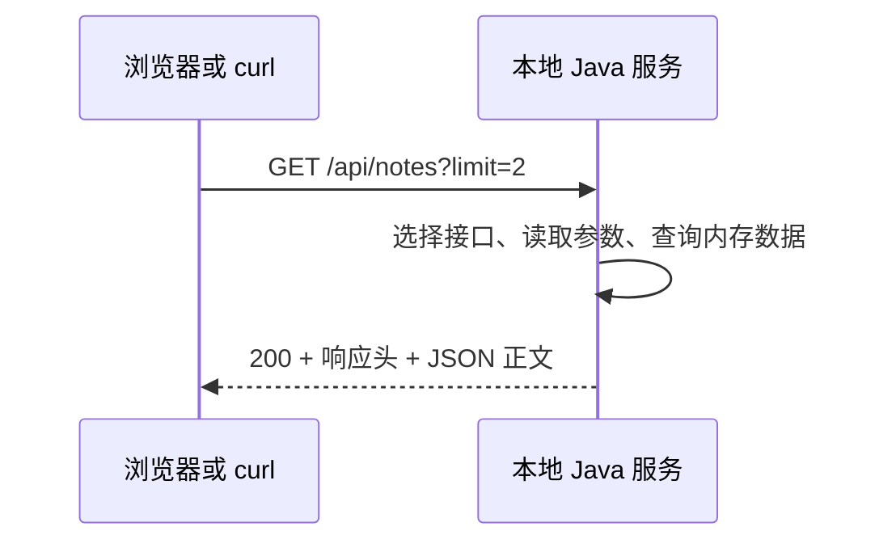

# Day 002：看懂 HTTP 请求与响应，用 curl 重现前端调用

你已确认完成 Day 001：能够编译并运行 Java 程序。今天把这条链路延伸到网络：Java 程序启动一个本地服务，浏览器和 curl 向它发请求，服务返回状态码、响应头和正文。

今天从后端接收与处理请求的角度观察 HTTP。你已有前端经验，可以快速完成界面操作，把主要时间用于解释请求内容和定位失败。

## 1. 目标与 150 分钟安排

| 时间 | 内容 | 当次产出 |
|---:|---|---|
| 10 分钟 | 回忆 Day 001，拉取仓库 | 理解启动服务也是运行 Java 程序 |
| 20 分钟 | 请求与响应、URL、方法和头 | 能拆解一个 HTTP 交换 |
| 15 分钟 | 启动实验服务 | 本地 GET 接口可响应 |
| 30 分钟 | 浏览器 Network 实验 | 记录 GET 和 POST 的请求与响应 |
| 30 分钟 | curl 重现请求 | 脱离浏览器完成查询、创建和读取 |
| 30 分钟 | 失败实验与解释练习 | 区分请求错误、业务校验和服务端失败 |
| 15 分钟 | 闭卷验收、笔记、提交 | 留下真实的请求观察记录 |

今天用到 Java 21、Maven、macOS 自带的 curl、浏览器。没有数据库或模型 API。实验服务的 Java 实现暂时作为工具使用，不要求今天掌握 HttpServer、集合或测试框架；你会在后续 Java 课程中逐步学会它们。

## 2. 从输出文字到返回响应

Day 001 中，main 计算结果并打印到终端。今天 main 启动一个等待请求的进程：



客户端发出请求，服务端根据接口约定处理，再返回响应。服务运行在哪里、当前有什么数据、如何校验输入，都影响最终结果。

本实验的条目保存在内存，重启恢复初始数据。持久化会在数据库阶段学习。

## 3. 一次交换包含什么

请求要看：**方法、URL、请求头、请求正文**。响应要看：**状态码、响应头、响应正文**。

下面是一个创建请求的 HTTP/1.1 文本示例：

```http
POST /api/notes HTTP/1.1
Host: 127.0.0.1:8082
Content-Type: application/json
Accept: application/json
Content-Length: 22

{"title":"HTTP notes"}
```

对应响应的关键部分可能是：

```http
HTTP/1.1 201 Created
Content-Type: application/json; charset=utf-8
Location: /api/notes/2

{"id":2,"title":"HTTP notes"}
```

响应示例省略了其他自动生成的头。示例中的数字 ID 对应新启动服务的首次创建；实际操作以返回结果为准。你不用手写 Content-Length，curl 或浏览器会计算它；它表示正文的字节数，包含中文时不能直接用字符个数代替。

空行用于分隔头部和正文。HTTP/2、HTTP/3 的传输编码不等同于这段文本，但方法、头、状态码等概念仍然适用，今天先掌握这些概念。

### URL 的各部分

```text
http://127.0.0.1:8082/api/notes?limit=2#results
│      │         │    │         │       └─ fragment：通常供客户端使用，不发送给服务器
│      │         │    │         └─ query：查询参数
│      │         │    └─ path：接口路径
│      │         └─ port：端口
│      └─ host：本机回环地址
└─ scheme：协议方案
```

本机实验用 HTTP；远程服务常用 HTTPS，为 HTTP 交换增加 TLS 保护，第 2 周再详细学习。

在本实验中：

- `/api/notes/1` 的 `1` 位于路径，用于标识一条资源。
- `?limit=2` 位于查询部分，控制列表最多返回多少条。
- POST 的 JSON 正文包含待创建数据。
- URL 中写了 `title` 不代表服务就会读取它；接口必须明确约定从哪里获取输入。

### 三个值得区分的头

| 头 | 意思 | 示例 |
|---|---|---|
| 请求 Content-Type | 我发送的正文是什么格式 | application/json |
| 请求 Accept | 我希望收到什么格式 | application/json |
| 响应 Content-Type | 实际返回的正文是什么格式 | application/json; charset=utf-8 |

设置 Content-Type 不会自动把普通字符串转换成 JSON。Accept 也不保证服务支持所有格式；本实验 API 固定返回 JSON。

HTTP 头名不区分大小写，所以工具显示 Content-type 或 content-type 时，仍是同一个头。

## 4. 启动本地实验服务

**从 Mac 上的仓库根目录开始。** 工作区干净时先同步：

```bash
git pull --ff-only origin main
java -version
mvn -version
curl --version
cd projects/http-playground
mvn -B -ntp test dependency:copy-dependencies
java -cp 'target/classes:target/dependency/*' com.dailystudy.day002.HttpPlayground
```

Maven 会运行已有的接口测试，并把运行依赖复制到 target/dependency。你今天需要会执行和观察结果，JUnit 的编写会在后续学习。

macOS classpath 使用 `:` 分隔；这里用引号包裹，避免 shell 提前展开 `*`。JVM 会使用指定目录的类和依赖。

预期终端提示端口 8082。**保持这个终端运行服务**；用另一个终端执行后面的 curl。结束时在服务终端按 Ctrl+C。

如果 8082 被其他程序占用，不要随意结束陌生进程。可改用：

```bash
java -cp 'target/classes:target/dependency/*' com.dailystudy.day002.HttpPlayground 8083
```

之后把本课请求的端口一起改成 8083。

云环境验证前，需要在每个新的命令上下文激活 Java 工具：`source /workspace/.dailystudy-tools/env.sh`。Mac 使用自己 Day 001 配置的工具链和项目路径。

实验服务只绑定 127.0.0.1，没有登录和数据库，供本地学习使用。它不是可直接公开部署的完整后端。

### 当前接口契约

| 方法 | 路径 | 输入 | 正常输出 |
|---|---|---|---|
| GET | /api/notes | limit，可选，1–20，默认 10 | 200，items 与 total |
| GET | /api/notes/{id} | 路径中的 ID | 200，id 与 title |
| POST | /api/notes | JSON 的 title，非空字符串，最长 120 字符 | 201，新条目与 Location |
| GET | /api/demo/failure | 无 | 500，课程用的模拟失败 |

每次启动预置一条 ID 为 1 的知识条目。GET 列表中的 total 是内存中全部条目数，items 是本次按 limit 截取的结果。

## 5. 浏览器实验：观察真正发送的内容

在你 **Mac 的本地浏览器地址栏**输入 `http://127.0.0.1:8082`。这需要本地服务已运行；云环境内的回环地址不会自动指向你的 Mac。

下面以 Chrome 为例：按 Command+Option+I 打开开发者工具，选择 Network，筛选 Fetch/XHR。

### A. GET 列表

1. 点击“准备 GET 列表”，再点击“发起请求”。
2. 在 Network 中选择 notes 请求。
3. 查看 Request URL、Request Method、Status Code。
4. 查看 Query String Parameters 与 Response。
5. 找出响应 Content-Type。

回答：limit 位于 URL 的哪一部分？这次 GET 是否发送了 JSON 正文？items 和 total 为什么可能不同？

### B. POST 创建

1. 点击“准备 POST 创建”。
2. 保持 Content-Type 为 application/json，正文为 `{"title":"理解 HTTP 请求"}`。
3. 发起请求，检查 Payload 中实际发送的正文。
4. 查看 201、Location 和响应中的 ID。
5. 再 GET 列表，确认新条目确实存在。

请求正文和响应正文是两个不同的数据：前者说明你要创建什么，后者告诉你实际创建了什么。

### C. 浏览器不会替后端完成校验

把 POST 正文改成 `{"title":"   "}`，发送后观察 422。即使按钮可以点击，服务端也应检查输入。

这个页面与 API 来自同一 origin，今天不会通过配置 CORS 解决其他错误。Cookie、Session、CORS、CSRF 在后续对应课程学习。

## 6. curl 实验：离开浏览器重现同一个请求

打开第二个终端。HTTP 请求不依赖当前目录，保持服务终端运行即可。

### GET 列表

```bash
curl -i 'http://127.0.0.1:8082/api/notes?limit=2'
```

`-i` 将响应头与正文一起打印。带查询的 URL 用引号包裹，避免 zsh 把某些字符当作匹配模式。

### POST 创建

```bash
curl -i -X POST 'http://127.0.0.1:8082/api/notes' \
  -H 'Content-Type: application/json' \
  -H 'Accept: application/json' \
  --data '{"title":"用 curl 创建的知识条目"}'
```

- `-X POST`：指定方法。
- `-H`：添加请求头。
- `--data`：发送正文；这份数据由单引号包裹，JSON 属性和值使用双引号。
- `\`：在 shell 中续行，它后面不要再添加空格。

curl 在使用 --data 时默认采用 POST，这里显式写出方法便于你观察。

### 根据 Location 读取

假设返回 Location 为 `/api/notes/3`，执行：

```bash
curl -i 'http://127.0.0.1:8082/api/notes/3'
```

以自己实际返回的 Location 为准。这个 GET 应返回刚才创建的条目。

### 有选择地观察请求

需要同时看请求与响应头时：

```bash
curl -v 'http://127.0.0.1:8082/api/notes?limit=1'
```

`>` 通常表示发送的头，`<` 表示收到的头。真实项目中，verbose 输出可能包含认证信息；分享前应删除这些字段。本实验不需要任何凭据。

注意小写 `-i` 与大写 `-I`：后者会发送 HEAD。本实验不支持 HEAD，因此不能用它替代 GET 验证。

## 7. 失败实验：先判断哪个环节出了问题

### 400：JSON 语法错误

```bash
curl -i -X POST 'http://127.0.0.1:8082/api/notes' \
  -H 'Content-Type: application/json' \
  --data '{"title":'
```

正文无法解析成完整 JSON，返回 400 和 invalid_json。错误请求不应创建条目。

### 415：正文类型与接口约定不符

```bash
curl -i -X POST 'http://127.0.0.1:8082/api/notes' \
  -H 'Content-Type: text/plain' \
  --data '{"title":"HTTP"}'
```

即使内容看起来像 JSON，声明的媒体类型也不符合接口要求，返回 415。

### 422：JSON 可解析，但字段不符合规则

```bash
curl -i -X POST 'http://127.0.0.1:8082/api/notes' \
  -H 'Content-Type: application/json' \
  --data '{"title":"   "}'
```

本实验用 422 表示 title 的业务输入规则未通过。有些接口统一使用 400，这要看契约；前后端需要对同一套规则达成一致。

### 404：指定的条目或接口不存在

```bash
curl -i 'http://127.0.0.1:8082/api/notes/999999'
```

服务仍在运行，已经收到并处理请求，然后明确告诉你资源不存在。

### 500：收到服务端失败响应

```bash
curl -i 'http://127.0.0.1:8082/api/demo/failure'
```

这是有意提供的失败模拟接口。随后请求列表仍应返回 200，说明收到 500 与“整个服务进程已经退出”不是同一件事。

### 扩展观察

- `GET /api/notes?limit=0` 返回 400：查询参数不符合契约。
- `DELETE /api/notes` 返回 405，响应头 Allow 表示目前支持的方法。
- 超过 8192 字节的 POST 正文返回 413。今天不必手工构造大正文。
- 401/403 会在登录权限阶段实现，本实验没有认证流程。

## 8. HTTP 状态、工具退出码、前端异常各有含义

先执行：

```bash
curl -i 'http://127.0.0.1:8082/api/notes/999999'
echo $?
```

默认 curl 成功收到一个 404 响应，通常仍返回退出码 0。它完成了传输，但 HTTP 业务请求没有成功。

再执行：

```bash
curl --fail -sS 'http://127.0.0.1:8082/api/notes/999999'
echo $?
```

这次 --fail 将 HTTP 失败映射为 curl 的非零退出码，通常是 22，并不展示错误正文。想看接口错误内容时使用前面不带 --fail 的实验命令。

页面中的 fetch 也需要检查：

```javascript
const response = await fetch('/api/notes/999999');
if (!response.ok) {
  // 已收到 HTTP 响应；根据 status 和错误正文处理。
}
```

404/500 本身通常不会让 fetch reject。连接失败等问题才会进入相应异常路径。今天只用同源接口观察这一行为。

最后在服务终端按 Ctrl+C，重新执行 GET：现在是连接失败，通常没有 HTTP 状态码。再启动服务，确认它恢复初始条目。

## 9. 怎么定位一次失败

按这个顺序收集证据：

1. 服务启动了吗？端口和地址是否正确？
2. 方法与路径是否符合接口契约？
3. 查询参数和正文是否放在正确位置？
4. Content-Type 与正文格式是否一致？
5. 状态码和错误正文是什么？
6. 是否需要进一步看服务日志或校验规则？

能用 curl 重现，有助于检查请求本身及后端处理。curl 和浏览器结果不同，还要比较两者实际发送的头、参数、正文及浏览器特有行为；不要只凭工具名称断定是谁的错误。

## 10. 练习和闭卷验收

完成 [练习](exercises.md)，先写预测，再记录结果。尝试不看命令示例完成：

- [ ] 用 GET 获取列表，说明 limit 位于哪里。
- [ ] 用 POST 创建条目，拿实际 Location 再 GET。
- [ ] 根据请求与响应说明 Content-Type 和 Accept。
- [ ] 分别复现 400、415、422、404、500，并解释原因。
- [ ] 解释“HTTP 404 + curl 退出码 0”为什么可能同时发生。
- [ ] 解释 fetch 如何处理收到的非 2xx 响应。
- [ ] 停止服务后区分连接失败与 HTTP 失败。

对应参考答案在 [solutions.md](solutions.md)。不需要今天背熟全部状态码，但要能根据真实请求诊断本实验的失败。

## 11. 写入你的观察记录

从仓库根目录执行：

```bash
cp lessons/day-002/worksheet.md notes/day-002.md
```

填写两次成功请求和至少三种失败，记录自己的实际结果。然后查看 git diff，只提交确认过的笔记和必要的学习修改：

```bash
git status --short
git diff
git add notes/day-002.md
git commit -m "study: complete day 002 HTTP exercises"
git push origin main
```

课程服务代码无需为了制造提交而修改。学习记录可成为本次学习的提交内容。

## 12. 按需阅读的资料

- [MDN：HTTP 消息](https://developer.mozilla.org/zh-CN/docs/Web/HTTP/Messages)：对照请求、响应结构。
- [MDN：HTTP 方法](https://developer.mozilla.org/zh-CN/docs/Web/HTTP/Methods)：今天重点 GET、POST。
- [MDN：HTTP 状态码](https://developer.mozilla.org/zh-CN/docs/Web/HTTP/Status)：查今天遇到的状态。
- [Chrome Network 面板文档](https://developer.chrome.com/docs/devtools/network/)：查看 Headers、Payload、Response。
- [curl 官方手册](https://curl.se/docs/manpage.html)：查 -i、-v、-H、--data、--fail。
- [B 站视频检索：HTTP 请求响应、curl](https://search.bilibili.com/all?keyword=HTTP%20%E8%AF%B7%E6%B1%82%E5%93%8D%E5%BA%94%20curl)：检索入口，未指定单个视频；有需要时只补相应主题。

本课程可独立完成，资料用于核对与补充。没有必要先看完一整套网络课程。

## 13. 下一次如何衔接

[Day 003](../day-003/README.md) 回到 Java：变量、输入、判断、循环与方法。你今天看到后端如何根据参数返回不同结果，接下来会亲手实现“根据输入选择行为”的小程序。第 4 次学习再把工具链与 HTTP 认识一起复盘。

完成后反馈你是否通过验收，以及最不确定的一项概念；有错误时提供执行命令、当前目录和错误原文。
